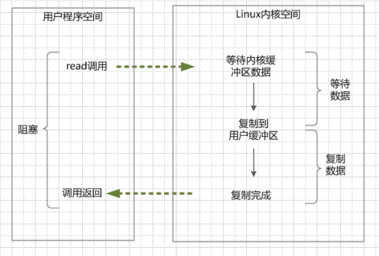

## NIO网络通信

### ByteBuffer

**ByteBuffer类型**

|                  | 描述                                                         | 特点                                                         |
| ---------------- | ------------------------------------------------------------ | ------------------------------------------------------------ |
| HeapByteBuffer   | 在jvm堆上面的一个buffer，底层的本质是一个数组                | 由于内容维护在jvm里，所以把内容写进buffer里速度会快些；并且，可以更容易回收 |
| DirectByteBuffer | 底层的数据其实是维护在操作系统的内存中，而不是jvm里，DirectByteBuffer里维护了一个引用address指向了数据，从而操作数据 | 跟外设（IO设备）打交道时会快很多，因为外设读取jvm堆里的数据时，不是直接读取的，而是把jvm里的数据读到一个内存块里，再在这个块里读取的，如果使用DirectByteBuffer，则可以省去这一步，实现zero copy |

**ByteBuffer属性**

- mark：记录了当前所标记的索引下标；
- position：对于写入模式，表示当前可写入数据的下标，对于读取模式，表示接下来可以读取的数据的下标；
- limit：对于写入模式，表示当前可以写入的数组大小，默认为数组的最大长度，对于读取模式，表示当前最多可以读取的数据的位置下标；
- capacity：表示当前数组的容量大小；
- array：保存了当前写入的数据。

**ByteBuffer方法**

- Buffer clear()：把position设为0，把limit设为capacity，复用Buffer时调用。
- Buffer flip()：把limit设为当前position，把position设为0，buffer填充数据后，读取时调用。
- Buffer rewind()：把position设为0，limit不变，buffer填充数据后，读取时调用。
- compact()：将 position 与 limit之间的数据复制到buffer的开始位置，复制后 position = limit -position，limit = capacity，删除已读取数据时调用。
- mark() & reset()：通过调用Buffer.mark()方法，可以标记Buffer中的一个特定position。之后可以通过调用Buffer.reset()方法恢复到这个position。

### Selector

BIO服务端与客户端进行通信时，Socket的accept、read、write方法都会阻塞当前线程，直到内核将准备数据完成，然后将数据拷贝到进程私有空间。在网络通信中就算客户端没有发送任何数据，服务端调用read方法后仍会一直阻塞直到接收到数据，所以服务端对于每个客户端的连接，都需要一个额外的线程去处理。

NIO一个比较重要的改进就是，在内核数据没有准备好的阶段，发起调用时会立即返回，只有当内核中已经有数据时，线程才会阻塞将复制数据到进程空间。所以需要有线程不断的轮询现有的channel，判断channel是否可用。这时就有很多不必要的对内核轮询发生，浪费cpu时间。

Selector是NIO的又一次改进，channel可以注册到Selector上，并标注需要的事件(SelectionKey)，在调用select方法时，可以直接将可用的Channel返回，避免一些空轮询。select方法跟轮询channel的区别在于，select方法是建立在操作系统内核提供的select和epoll方法（epoll通过维护活跃channel来减轻内核轮询压力）上进行的，select方法只需要对内核一次调用，就可以获取需要的channel。理论上来说可以由一个线程完成与多个客户端的通信。

## NIO性能优化

### Reactor线程模型

虽然单线程就可以完成与客户端的通信，但是如果业务耗时过长，就会影响整个系统的效率。

所以基于NIO再封装的Netty就提供了BossGroup与WorkGroup的两个参数，由两个线程组分别处理通信逻辑和业务逻辑。这其实就是对Reactor线程模型的实现，BossGroup与WorkGroup分别对应Acceptor和Handler。

Reactor线程模型就是网络通信的逻辑跟业务逻辑分开，Acceptor负责网络通信，Handler负责业务逻辑。单线程Reactor模型其实还是一个线程负责所有逻辑，多线程模型就是将Acceptor跟Handler交由不同的线程组。主从多线程模型就是对Acceptor的再次拆分，主Acceptor只负责分配新连接，从Acceptor（Processor）负责完成连接与读写事件。

### Channel的读写事件

channel只有在收到数据时才会触发读事件，但只要channel没有被写满，就会一直触发写事件。

一般来说只要读取完毕一次请求，需要暂时取消对读事件的关注，将读取到的请求交由handler之后，再进行继续关注读事件。写事件要尽量在响应数据准备好时再去关注。

### 批量发送

网络IO的速度要比内存的速度少几个数量级，离硬盘速度也有很大差距，所以在进行网络通信时，要尽量减少消息的大小以及发送次数。常见的方式，比如kafka用的就是消息的批量发送以及数据压缩，但是需要系统能够容忍批量发送带来的延时，以及数据丢失问题，一般来说支持批量发送的中间件都会提供两个参数：批量发送的最大大小以及最大等待时间。

### BufferPool

对于ByteBuffer的申请和释放都是比较昂贵的，大多数BufferPool的大小要远大于普通对象的大小，频繁申请会导致FullGC次数的明显提升，如果申请的是DirectBuffer，而且没有对JVM能够使用的直接内存进行限制，很容易造成堆外内存泄露。所以一般来说都会对ByteBuffer进行统一管理。

### 虚拟内存文件映射

NIO文件映射

将进程的虚拟空间跟文件的某一部分建立起映射关系，当进程第一次访问这段空间时，触发缺页异常，OS根据映射关系直接将文件的部分数据拷贝到进程的私有空间，相比于传统IO少了数据拷贝到OS内核缓冲区这一步。而且由于内存文件映射技术没有OS内核缓冲区，所以对文件的修改对其他进程也是共享的。在java提供的三种内存映射模式中，private模式的写用的是写时拷贝，会把修改的部分拷贝到进程私有空间，不会对其他进程共享。

### 最后

今天分享只是望其门墙，大多是应用的东西，避开了深邃的操作系统知识，nio-mq项目也只完成了producer和broker的通信基础，broker的消息存储也只是完成了大体的框架，尽量在下次分享上带来一个完善的kafka核心逻辑。

